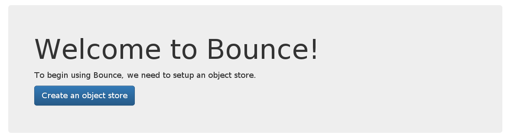
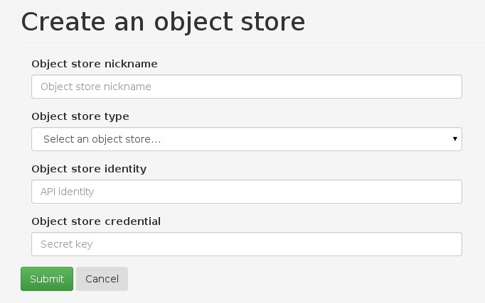
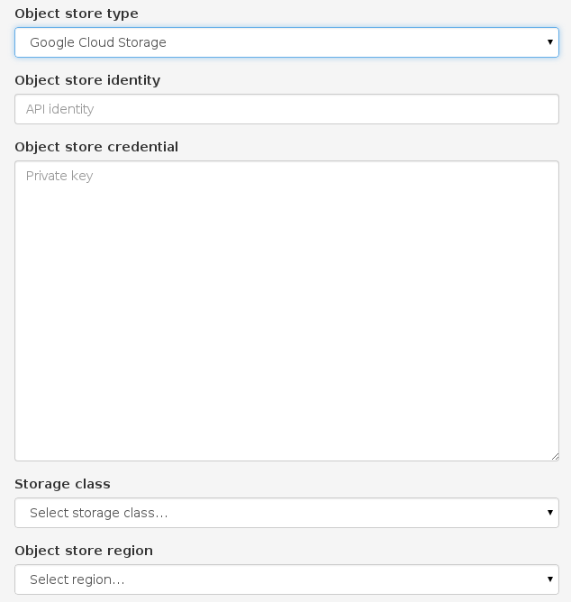
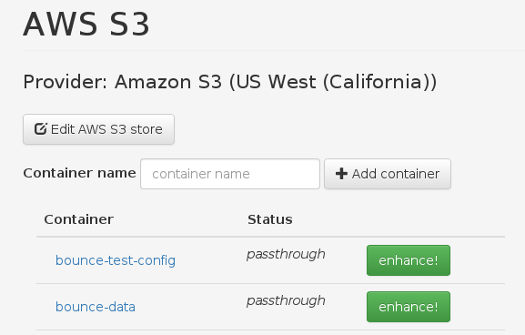
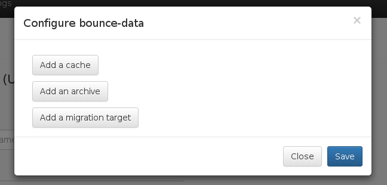
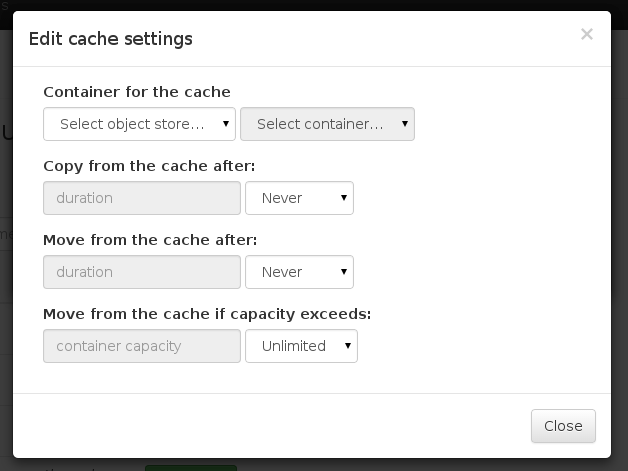
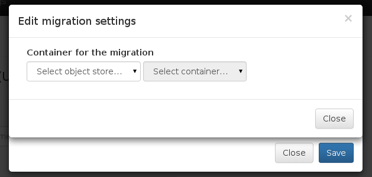
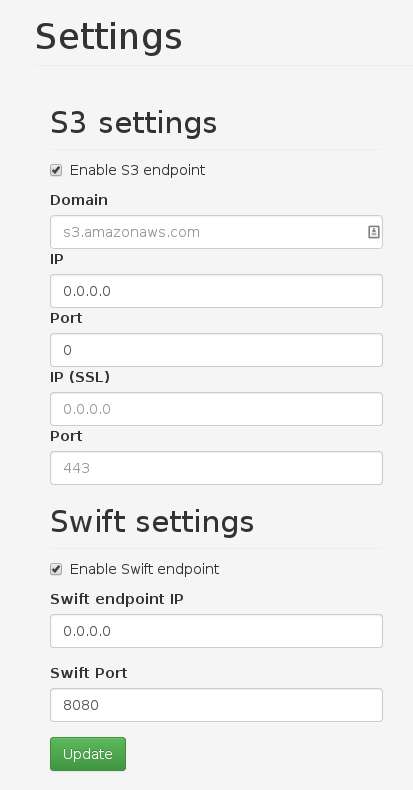
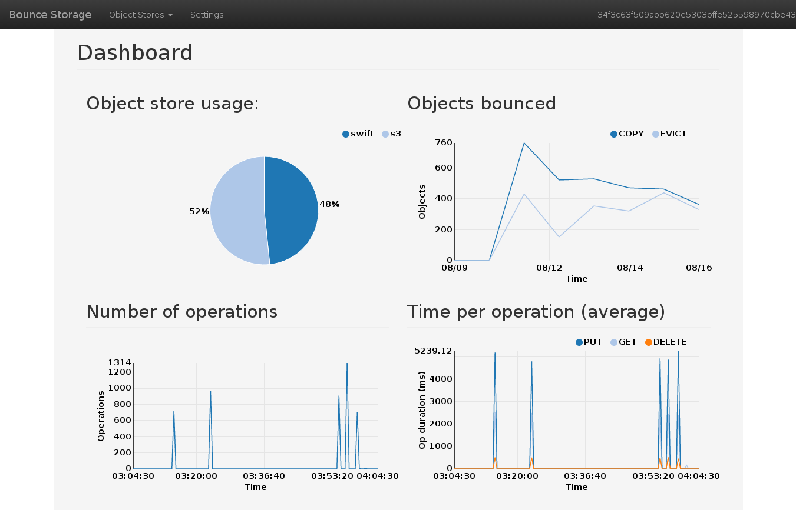

Bounce Deployment Guide
=======================

## Background
Bounce is distributed as a docker container. Docker environment and access to
the object stores is required to set it up.

Bounce needs to have access to the object stores. If you are using a public
object store, make sure that the Bounce container and the host have access to
the external endpoint for the cloud provider.

The Bounce configuration UI is available on port 9000. Make sure to make this
port accessible. Applications can connect to Bounce through an S3 or Swift
interface. Each interface can be configured to run on a preferred port, as
opposed to the defaults: 80 and 8080, respectively.

## Initial configuration

### Launching the container

The docker container may be launched with the following command:

	docker run -d -P bounce-image

This will launch the container in daemon mode (`-d`) and expose all of its ports
(`-P`). The ports will be exposed on random local ports. To specify a port, pass
the `-p` option instead (e.g. `-p 9000:9000`).

docker may also use the host's networking stack by specifying `--net=host`
option when starting the container. More information about these options can be
gleaned from the [docker documentation](https://docs.docker.com/).

## Initial configuration

### Creating an object store

Before any of the Bounce features may be used (and any data passed through the
service), it needs to obtain the credentials for at least one object store.
Bounce presents a _Welcome_ screen with a button to create a store.

For all object stores -- public and private -- a nickname, identity, and a
credential are required. For OpenStack Swift, you must also enter the endpoint
for Bounce to reach (this would be the same endpoint as the existing clients
use).

For Amazon S3, OpenStack Swift, and Google Cloud Storage, region may also be
specified. Bounce uses this parameter when creating a new container (or a bucket
in S3) and when listing containers in Google Cloud Storage.

Lastly, Bounce supports different storage tiers for Google Cloud Storage:
Standard, Nearline, and Durable reduced availability. Please
[refer](https://cloud.google.com/storage/docs/storage-classes) to Google for
details about each storage class.

You can create additional object stores through the Object Stores drop down at
the top of the navigation bar.

### Object store

After configuring the first object store, the next view is the Object store page
showing all of the containers for the just-configured Object Store. Clicking on
_Object Stores_ at the top navigation menu allows you to select a different
store or to create another store.

Bounce uses virtual containers to set policies for the data in the object store.
To set a policy for a specific container, click on _enhance!_. The "enhance"
prompt allows for configuring a cache, an archive, or a migration target for
each container.

For all policies, a secondary container must be defined -- whether it be the
location of the cache, archive, or the migration target. Some of the policies
have additional configuration options.

#### Cache and archive policies

Cache and archive policies, in addition to selecting the secondary container,
require setting either a time-based policy or a capacity limit.

The time-based policy has two settings:

1. replication timeout
2. eviction timeout

All objects which are older than the replication timeout will be copied to the
next storage tier, i.e. moved to the primary container in the case of a cache or
to archive if the objects are in the primary store.

Similarly, after the eviction timeout for the object elapses, the object is moved
to the following tier. When listing objects through Bounce, the eviction is
transparent and all objects are accessible as they would be otherwise. However,
the requests do come from a different tier.

An alternative to a time-based policy is to set storage limits on the container.
If the total size of the objects in the container exceeds the set capacity, the
objects are moved to the next tier, starting with the oldest objects.

If a client requests an object that has been evicted, the object will be placed
back into the closer tier, i.e. from archive into the primary or from primary
into the cache.

#### Migration policy

Migration policy is not compatible with the caching or archive policies. If
either is configured, migration cannot be configured. The migration policy moves
all data from the primary container (the one being "enhanced") to the configured
target. Any new requests to write data into the system are routed to the target
location. In the background, objects are continuously moved, while still
allowing access to them. If an object is not available in the target location,
it is fetched from the source.

There are no additional settings for the Migration policy.

## Bounce Settings

Bounce allows a number of settings to be re-configured. The _Settings_ page may
be accessed from the navigation menu at the top of the screen.

S3 or Swift interface may be disabled or enabled as necessary. For each
interface, the associated port may be changed. For S3, Bounce also supports
HTTPS. The network interface that Bounce uses may also be re-configured. If
Bounce should listen on *all* interfaces, set the value to `0.0.0.0`.

NOTE: if Bounce is running inside a Docker container, after changing the port
for the application, the container may need to be re-built to expose the port.

## Bounce Dashboard

Finally, once Bounce is configured, the dashboard is the first screen you will
see. The dashboard displays statistics about the current usage of the object
store: the number and kind of requests, as well as the amount of storage used.

